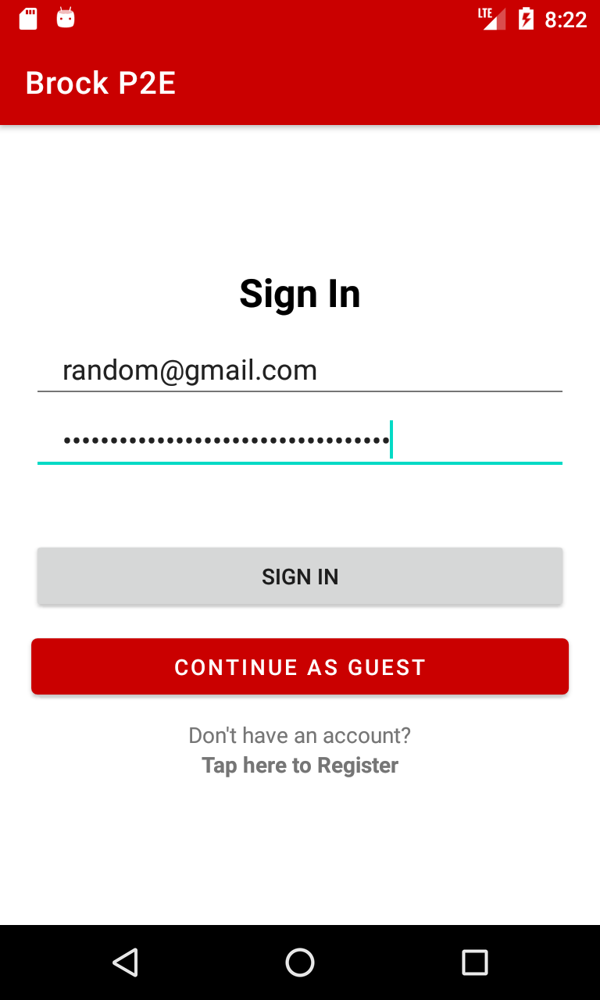
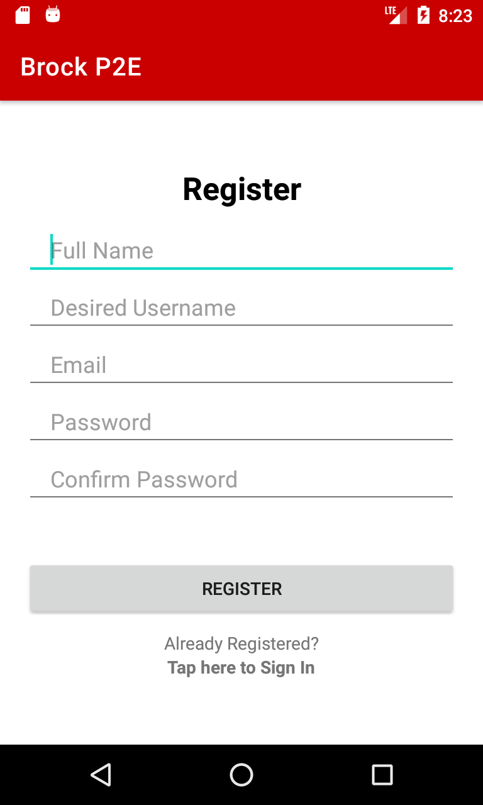
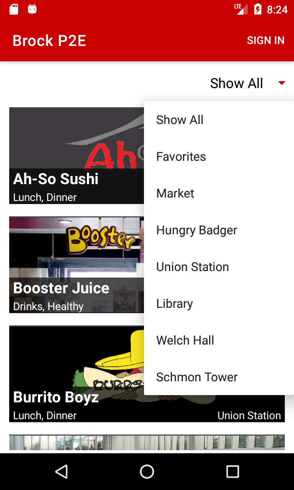
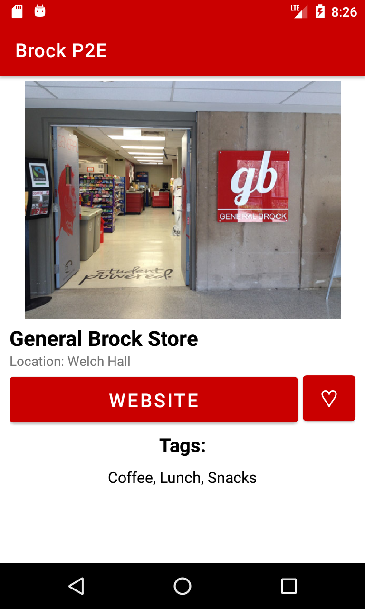
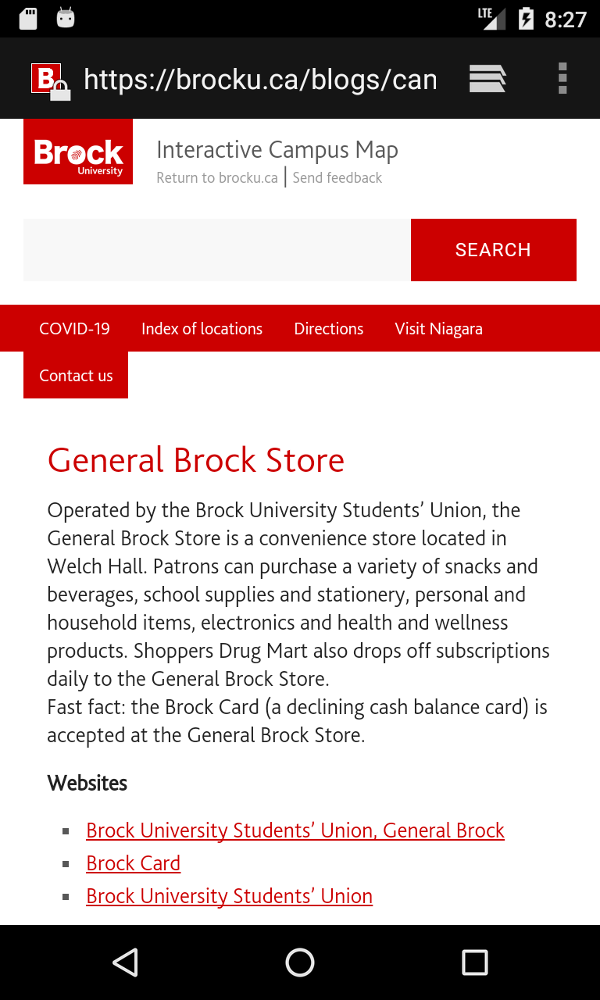

# Brock Plan 2 Eat

## :vibration_mode: Description

An Android Application for displaying available food and/or drink establishments on Brock University campus.
Built using Java and Android Studio.

**This app is in no way endorsed or sanctioned by the university.**

## :camera_flash: Features
####  User Login and Registration

    
    

<!-- TODO: #### Customizable list of favorite restaurants -->
#### Location-based filters
- Each restaurant is labeled with a general location within campus.
- The location-based filter narrows down the list of establishments that are available.

    
    

<!-- TODO: #### Interactive chatbot -->

#### Restaurant Tags and Embedded Links
- Each establishment that Brock University features has embedded links that direct to the official website.
- Institutional food establishments may not have any websites, and must be viewed in person. 

    
    

## :hammer_and_pick: Tools Used
- [BrainShop API](https://brainshop.ai/)
- [Firebase Realtime Database](https://firebase.google.com/docs/database)

## 👥 Contributors
|Name|
|---|
| [Ibrahim Hashmi](https://github.com/ibhashmi) |
| [Julian Ellis Geronimo](https://github.com/Julellisg) |
| [Vinit Udasi](https://github.com/vinitudasi) |

## :film_strip: Demo

    

